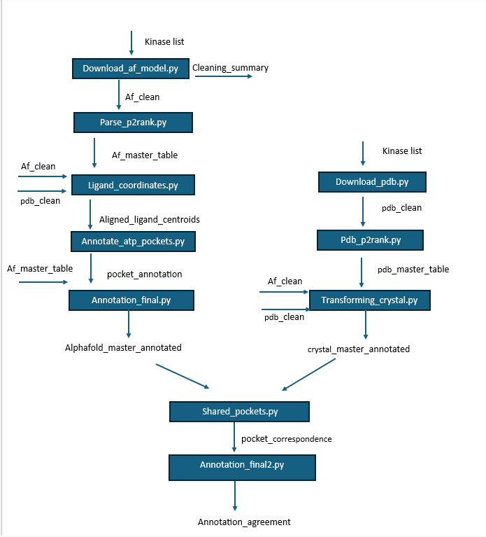

# Machine Learning-Based Pocket Prediction and Characterization on Protein Kinase Conformational Ensembles

## Overview

Protein kinases are among the most important therapeutic targets in modern drug discovery due to their central roles in cellular signaling, growth, metabolism, and differentiation. Identification of ligand-binding pockets is a fundamental step in structure-based drug design because these regions determine ligand recognition, binding affinity, and inhibitor selectivity.

This project evaluates the performance of **P2Rank**, a machine learning-based ligand-binding pocket prediction tool, on a dataset of human protein kinases. Pocket predictions generated from **AlphaFold models** and **experimentally determined crystal structures** are compared using structural alignment, ligand information, and pocket annotation analyses.

The workflow integrates structure retrieval, pocket prediction, ligand coordinate extraction, pocket annotation, and correspondence analysis to assess whether binding-site predictions derived from AlphaFold models reproduce experimentally observed binding regions.

This work was developed as part of the **BSB 680: Current Topics in Systems Biology** course project.

---

## Project Information

**Course:** BSB 680 – Current Topics in Systems Biology

**Supervisor:** Onur Serçinoğlu

**Project Members:**

* Abdullah Uğurlu
* Şevval Dik

---

## Objectives

The primary objectives of this study are:

* Predict ligand-binding pockets in human protein kinases using P2Rank.
* Identify experimentally validated ligand-binding regions from crystal structures.
* Annotate predicted pockets according to ligand proximity.
* Compare binding-site predictions obtained from AlphaFold and crystal structures.
* Evaluate the agreement between predicted and experimentally observed binding sites.
* Assess the reliability of AlphaFold models for binding-site characterization.

---

## Dataset

The dataset consists of **50 human protein kinases** selected from the KinCore database.

For each kinase:

* A ligand-bound experimental crystal structure was obtained from the Protein Data Bank (PDB).
* A corresponding AlphaFold structure was retrieved from the AlphaFold Protein Structure Database.

Both well-characterized and relatively understudied ("dark") kinases were included.

---

## Software Requirements

### Core Software

* Python 3.11
* P2Rank 2.5
* PyMOL

### Python Packages

* pandas
* numpy
* biopython
* matplotlib

Install required packages:

```bash
pip install pandas numpy biopython matplotlib
```

Alternatively, create the project environment using:

```bash
conda env create -f environment.yml
conda activate lbs_project
```

---

## Workflow

The complete analysis workflow is illustrated below and serves as the primary guide for reproducing the study.



**Figure 1.** Computational workflow used for ligand-binding pocket prediction, annotation, and comparison between AlphaFold-predicted and experimentally determined kinase structures.

### Pipeline Description

The workflow consists of two parallel branches that process AlphaFold models and experimentally determined crystal structures before integrating the results into a common pocket comparison framework.

In the **AlphaFold branch**, kinase structures are downloaded and cleaned by removing low-confidence regions based on residue-level confidence scores. P2Rank is then used to identify potential ligand-binding pockets and calculate pocket descriptors. Experimental ligand coordinates derived from crystal structures are mapped into the AlphaFold coordinate system through structural alignment, allowing predicted pockets to be annotated according to their proximity to known ligand-binding sites.

In the **crystal structure branch**, experimentally determined kinase structures are retrieved and analyzed using the same pocket prediction strategy. Pocket coordinates are transformed into the AlphaFold reference frame, enabling direct comparison between pockets identified in experimental and predicted structures.

The final stage of the workflow identifies corresponding pockets between AlphaFold and crystal structures based on spatial proximity. Annotation labels assigned independently in both datasets are then compared to evaluate the extent to which AlphaFold-derived pocket predictions reproduce experimentally observed binding-site annotations.

The execution order of all analysis steps, intermediate datasets, and data dependencies is summarized in **Figure 1** and should be used as the primary reference when reproducing the workflow.

---

## Methodological Summary

### Structure Preparation

AlphaFold models were filtered using residue-level pLDDT confidence scores. Residues with average pLDDT values below 50 were removed before pocket analysis to improve structural reliability.

Crystal structures were cleaned by retaining relevant protein chains and removing water molecules and non-essential heteroatoms.

### Pocket Prediction

Binding pockets were predicted using P2Rank:

* AlphaFold-specific prediction model for AlphaFold structures
* Default prediction model for crystal structures

For each predicted pocket, information including pocket rank, score, probability, center coordinates, and residue composition was extracted.

### Ligand Mapping and Annotation

Experimental ligand coordinates were extracted from ligand-bound crystal structures and transformed into the AlphaFold coordinate system through structural alignment.

The transformed ligand centroids were then used to identify the predicted pocket most closely associated with the experimentally observed binding site, enabling biologically meaningful pocket annotation.

### Pocket Correspondence Analysis

Following structural alignment, pocket center coordinates from AlphaFold and crystal structures were compared using Euclidean distance.

Spatially nearest pockets were assigned as corresponding pocket pairs, providing a framework for evaluating annotation consistency between predicted and experimentally determined structures.

---

## Repository Structure

```text
.
├── README.md
├── environment.yml
├── alphafold.ds
│
├── data/
│   ├── alphafold_raw/
│   ├── alphafold_clean/
│   ├── pdb_raw/
│   ├── pdb_clean/
│   └── kinases_list.xlsx
│
├── docs/
│   └── pipeline.png
│
├── scripts/
│   ├── alphafold_scripts/
│   ├── pdb_scripts/
│   └── shared/
│
├── results/
│   ├── alphafold_results/
│   ├── pdb_results/
│   ├── joint/
│   └── figures/
│
├── figures/
│
├── debug/
│   └── egfr_af_superposed.pdb
│
└── p2rank_2.5/
```

---

## Key Findings

* AlphaFold kinase models generally exhibited sufficient structural confidence for binding-site analysis.
* P2Rank successfully identified biologically relevant binding regions in both AlphaFold and crystal structures.
* Larger pockets generally received higher P2Rank scores, reflecting the influence of pocket geometry and solvent-accessible surface area.
* Pocket score alone was not strongly associated with agreement with experimentally observed ligand-binding sites.
* Ligand-bound (holo) structures produced pocket predictions that were substantially closer to experimentally observed ligand positions than apo structures.
* Many AlphaFold-derived pockets could be matched to corresponding crystal structure pockets through spatial correspondence analysis.
* Shared pockets frequently exhibited consistent biological annotations between AlphaFold and experimentally determined structures.

---

## References

1. Roskoski, R. Jr. (2024). Properties of FDA-approved small molecule protein kinase inhibitors: a 2024 update. *Pharmacological Research*, 200, 107059.

2. Anderson, B., Rosston, P., Ong, H. W., Hossain, M. A., Davis-Gilbert, Z. W., & Drewry, D. H. (2023). How many kinases are druggable? A review of our current understanding. *Biochemical Journal*, 480(16), 1331–1363.

3. Krivák, R., & Hoksza, D. (2018). P2Rank: machine learning based tool for rapid and accurate prediction of ligand binding sites from protein structure. *Journal of Cheminformatics*, 10(1), 39.

4. Modi, V., & Dunbrack, R. L. Jr. (2022). KinCore: a web resource for structural classification of protein kinases and their inhibitors. *Nucleic Acids Research*, 50(D1), D654–D664.

5. Polák, L., Škoda, P., Riedlová, K., Krivák, R., Novotný, M., & Hoksza, D. (2025). PrankWeb 4: a modular web server for protein–ligand binding site prediction and downstream analysis. *Nucleic Acids Research*, 53(W1), W466–W471.
